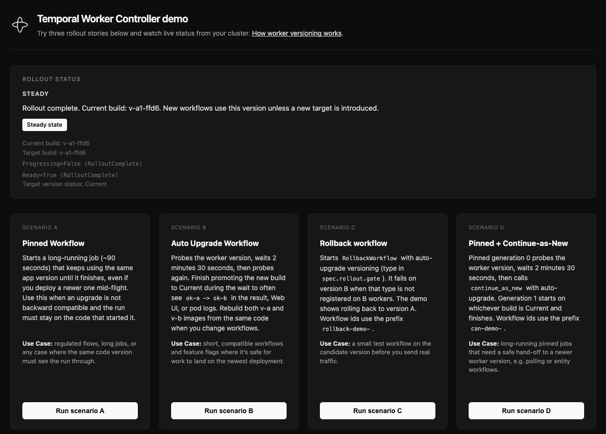

# Temporal Worker Controller demo

A hands-on demo of **[Worker Versioning](https://docs.temporal.io/worker-versioning)** + the **[Temporal Worker Controller](https://github.com/temporalio/temporal-worker-controller)** on Kubernetes. A small **FastAPI** service starts test workflows and reads worker-deployment status from the cluster. A **React** UI runs four scenarios and shows the rollout state in real time.



You'll see how four common workflow shapes behave during a rolling upgrade from worker version **A** to version **B**:

- **A** — a long pinned workflow stays on its starting version
- **B** — an auto-upgrade workflow can finish on a newer version
- **C** — a workflow type missing on B fails until you roll back to A
- **D** — a pinned workflow that uses `continue_as_new` to hand off to a newer version

## You will need

| Tool | Purpose |
|------|---------|
| Docker (Rancher Desktop recommended) | Build `worker-controller-demo:v-a` / `:v-b` images |
| Kubernetes (Rancher Desktop, kind, k3d, etc.) | Runs the controller + worker pods |
| `kubectl` | Apply manifests, watch state |
| Helm 3 | Install cert-manager + the worker controller |
| Temporal Cloud account (or self-hosted ≥ 1.29.1) | Worker Versioning enabled |
| `uv` (Python) and `Node.js` + `npm` | Run the demo API and UI on your laptop |

## Setup (one-time)

### 1. Install cert-manager and the worker controller

```bash
# cert-manager (TLS for the controller's admission webhook)
helm repo add jetstack https://charts.jetstack.io --force-update
helm install cert-manager jetstack/cert-manager \
  --namespace cert-manager --create-namespace --set crds.enabled=true

# Worker controller CRDs + chart (pick a release from
# https://github.com/temporalio/temporal-worker-controller/releases)
helm install temporal-worker-controller-crds \
  oci://docker.io/temporalio/temporal-worker-controller-crds \
  --version <VERSION> --namespace temporal-system --create-namespace

helm install temporal-worker-controller \
  oci://docker.io/temporalio/temporal-worker-controller \
  --version <VERSION> --namespace temporal-system

# Sanity check
kubectl get pods -n temporal-system
```

### 2. Create the demo namespace and your Temporal Cloud API key Secret

In Temporal Cloud, create an API key (UI → **API Keys** → **Create**). Then:

```bash
kubectl create namespace worker-controller-demo
kubectl create secret generic temporal-api-key -n worker-controller-demo \
  --from-literal=api-key='YOUR_API_KEY'
```

### 3. Apply the `TemporalConnection` (tells the controller how to reach Temporal)

```bash
cp k8s/temporal-connection.example.yaml k8s/temporal-connection.yaml
# Edit spec.hostPort to your regional gRPC host (e.g. us-east-1.aws.api.temporal.io:7233)
kubectl apply -f k8s/temporal-connection.yaml
```

### 4. Build the two worker images

```bash
# v-a: registers all workflow types
docker build -t worker-controller-demo:v-a --build-arg DEMO_WORKER_VERSION=a .

# v-b: omits ONLY RollbackWorkflow (Scenario C will fail on v-b until rollback).
# RolloutGate stays registered so the controller's rollout gate succeeds and the ramp completes.
docker build -t worker-controller-demo:v-b --build-arg DEMO_WORKER_VERSION=b \
  --build-arg DEMO_OMIT_ROLLBACK=1 .
```

### 5. Apply the `TemporalWorkerDeployment` (starts v-a workers)

```bash
cp k8s/temporal-worker-deployment.example.yaml k8s/temporal-worker-deployment.yaml
# Edit spec.workerOptions.temporalNamespace to your Temporal Cloud namespace
kubectl apply -f k8s/temporal-worker-deployment.yaml

# Watch until CURRENT and TARGET are both v-a-<hash> and RolloutComplete
kubectl get twd -n worker-controller-demo -w
```

### 6. Fill in `.env` for the demo API

```bash
cp .env.example .env
```

| Variable | Value |
|----------|-------|
| `TEMPORAL_ADDRESS` | Your regional gRPC host (matches the `TemporalConnection`) |
| `TEMPORAL_NAMESPACE` | Same as `spec.workerOptions.temporalNamespace` in the TWD |
| `TEMPORAL_API_KEY` | The API key value you put in the K8s Secret |
| `TEMPORAL_TASK_QUEUE` | `worker-controller-demo` (matches the TWD) |
| `K8S_NAMESPACE` | `worker-controller-demo` |
| `K8S_TWD_NAME` | `worker-controller-demo` |
| `TEMPORAL_DEPLOYMENT_NAME` | `worker-controller-demo/worker-controller-demo` *(set this — controller prefixes the K8s namespace; needed for pin-to-current in Scenario A)* |

Keep `.env` out of git (it's already in `.gitignore`).

## Run the demo

### 1. Start the API and UI

```bash
uv sync
uv run demo-api                 # terminal 1

cd web && npm install
npm run dev                      # terminal 2
```

Open **http://localhost:5173**. The top panel shows live `TemporalWorkerDeployment` status. Four cards below run the scenarios.

### 2. Verify steady state on v-a

`kubectl get twd -n worker-controller-demo` should show `CURRENT = TARGET = v-a-<hash>`, `RolloutComplete`. Click **Run scenario A**, then **B**, then **C** — all complete successfully on v-a.

### 3. Scenario D — pinned + continue-as-new

Click **Run scenario D**. The workflow starts pinned on v-a, probes (`ok-a`), sleeps **2 minutes 30 seconds**, then calls `continue_as_new` with `initial_versioning_behavior=AUTO_UPGRADE`. **While it's sleeping**, do the rollout:

```bash
# Edit k8s/temporal-worker-deployment.yaml:
#   image: worker-controller-demo:v-b
#   DEMO_WORKER_VERSION: "b"
kubectl apply -f k8s/temporal-worker-deployment.yaml
kubectl get twd -n worker-controller-demo -w
```

The controller's `RolloutGate` workflow runs on v-b and succeeds, the ramp progresses **25% → 50% → 75% → Current**, and `CURRENT` becomes `v-b-<hash>`. When Scenario D's timer fires, gen 0 closes on v-a (`ContinuedAsNew`) and gen 1 starts on whichever build is Current now (v-b) and completes. Result: `gen=1 probe=ok-b`. You've just demonstrated a safe pinned-workflow handoff to a newer worker version.

### 4. Scenario C — fails on v-b, recovers on rollback

With v-b now Current, click **Run scenario C**. v-b workers don't register `RollbackWorkflow` → workflow task fails repeatedly with `class not registered` (visible in Temporal Web). The workflow keeps running (no timeout). Now roll back:

```bash
# Edit k8s/temporal-worker-deployment.yaml back to image: worker-controller-demo:v-a
# and DEMO_WORKER_VERSION: "a"
kubectl apply -f k8s/temporal-worker-deployment.yaml
```

The controller ramps Current back to v-a. The pending workflow's next workflow-task retry is auto-upgraded to v-a, runs, and the workflow completes with `ok-a`.

### 5. Scenario A and B during a rollout

Run **A** and **B** on v-a, then start a rollout to v-b mid-flight. Scenario A's pinned workflow stays on v-a until it finishes. Scenario B's auto-upgrade workflow may finish on v-b — result `ok-a -> ok-b` if v-b becomes Current during the 2:30 sleep.

## Reset when things get stuck

If a ramp halts or you want a clean baseline:

```bash
kubectl delete twd worker-controller-demo -n worker-controller-demo
# Wait for pods to drain
kubectl get pods -n worker-controller-demo

# Flip k8s/temporal-worker-deployment.yaml back to image: worker-controller-demo:v-a
kubectl apply -f k8s/temporal-worker-deployment.yaml
```

Drained worker-deployment versions on the Temporal side are harmless leftover bookkeeping; they don't block a fresh apply unless you reuse the exact same pod template hash. Bumping the image tag (e.g. `:v-b1`) is the simplest way to force a brand-new build id.

## Common questions

- **The UI shows "pin skipped" for Scenario A or C.** Set `TEMPORAL_DEPLOYMENT_NAME=<k8s-namespace>/<twd-name>` in `.env` (the controller prefixes the K8s namespace; the API needs the full name to pin to the right `(deployment, build)` pair).
- **Status panel stays empty.** `demo-api` uses your `kubeconfig` to read TWD status. Run `kubectl get twd -n worker-controller-demo` from the same machine to confirm the context is right.
- **Self-hosted Temporal.** Set `TemporalConnection.spec.hostPort` to your frontend (e.g. `temporal-frontend.temporal:7233`) and follow the controller's [configuration guide](https://github.com/temporalio/temporal-worker-controller/blob/main/docs/configuration.md) for TLS/mTLS. Drop `TEMPORAL_API_KEY` from worker pods if unused.

## Repository layout

- `activity/` — `probe_version`, `slow_step`
- `workflows/` — `PinnedDemo` (A), `AutoUpgradeDemo` (B), `RollbackWorkflow` + `RolloutGate` (C), `PinnedCanDemo` (D)
- `worker/` — versioned worker with readiness probe on `:8080`
- `api/` — FastAPI service (`demo-api`)
- `web/` — Vite + React UI (proxies `/api` to the API)
- `k8s/` — example `TemporalConnection` and `TemporalWorkerDeployment` manifests

## References

- [Worker Versioning](https://docs.temporal.io/worker-versioning)
- [Temporal Worker Controller](https://github.com/temporalio/temporal-worker-controller)
- [Continue-as-new](https://docs.temporal.io/workflows#continue-as-new)
